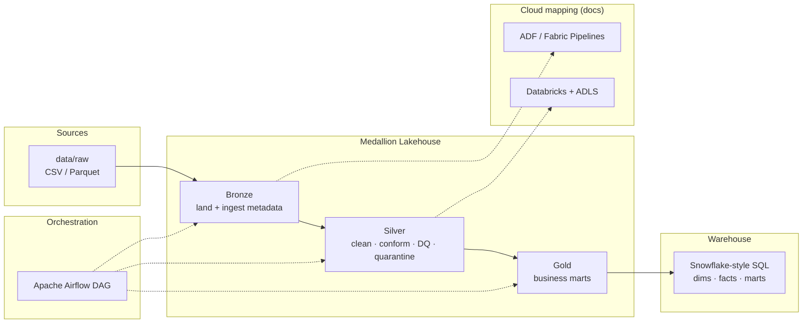

# Retail Sales Medallion Pipeline

End-to-end retail sales and customer-service analytics on a bronze → silver → gold (medallion) lakehouse layout, with Airflow orchestration, Snowflake-flavored SQL marts, Tableau workbooks, and cloud mapping notes for Azure Data Factory / Databricks / ADLS / Microsoft Fabric.

**Repo:** [github.com/user-JB007/retail-sales-pipeline](https://github.com/user-JB007/retail-sales-pipeline)

---

## Tableau Reports

**Primary BI tool: Tableau.** Pipeline code and two Tableau workbooks live in this repo — dashboard pages are visible on GitHub without Tableau Desktop.

### Report 1 — Sales Report
Revenue, orders, stores/regions, categories/products, and trends.

| Page | Preview |
|------|---------|
| Overview |  |
| Stores & Regions |  |
| Trends |  |

### Report 2 — Customer Satisfaction & Service Report
Complaints and service tickets: CSAT, resolutions within/beyond SLA, pending queue, aging, reason and channel breakdowns.

| Page | Preview |
|------|---------|
| Overview |  |
| SLA Performance |  |
| Pending & Aging |  |

**Desktop / Public rebuild** (workbook briefs, LOD calcs, mart CSVs): [`tableau/README.md`](tableau/README.md)

```bash
python scripts/run_local.py --engine pandas
python src/viz/generate_tableau_pages.py --export-marts
```

---

## Architecture



| Layer | What it does |
|-------|----------------|
| **Raw** | Stores, products, customers, sales transactions, service tickets |
| **Bronze** | Parquet landing with `_ingest_ts`, `_source_system`, run id |
| **Silver** | Typed dims/facts (sales + service), quarantine invalid rows, DQ report |
| **Gold** | Daily store/category sales, CLV, product performance, channel mix, service/SLA mart |
| **SQL** | Snowflake-flavored schemas, dims, facts, gold CTAS/views |

---

## Tech stack

| Concern | Choice |
|---------|--------|
| Transforms | Python + **PySpark job structure** with **pandas fallback** (default for local/CI) |
| Architecture | Medallion (bronze / silver / gold) |
| Orchestration | Apache Airflow DAG (`dags/`) |
| Warehouse | Snowflake-flavored DDL + marts (`sql/`) |
| Quality | Custom DQ checks with fail-on-error gate |
| BI | Tableau workbooks + screenshots (`tableau/`) |
| Cloud design | ADF, Databricks, ADLS, Fabric — see `docs/cloud_mapping.md` |

---

## Quick start

```bash
# 1. Clone & install
git clone https://github.com/user-JB007/retail-sales-pipeline.git
cd retail-sales-pipeline
python -m venv .venv && source .venv/bin/activate   # optional
pip install -r requirements.txt

# 2. Run the full pipeline (generate → bronze → silver → gold)
python scripts/run_local.py --engine pandas

# 3. Inspect outputs
ls data/gold/*/data.csv
cat data/gold/pipeline_outputs.json
```

Regenerate raw extracts only:

```bash
python -m src.generate_source_data --n-transactions 5000 --n-tickets 1800
```

Run layers individually:

```bash
python -m src.jobs.bronze_ingest --engine pandas
python -m src.jobs.silver_transform --engine pandas
python -m src.jobs.gold_aggregates --engine pandas
```

Tests:

```bash
pytest -q
```

### Optional PySpark

```bash
pip install "pyspark>=3.4,<4"   # requires Java 11+
unset FORCE_PANDAS
python scripts/run_local.py --engine spark
```

### Airflow

Point `RETAIL_PIPELINE_HOME` at this repo and drop `dags/retail_sales_pipeline_dag.py` into your Airflow `dags/` folder (or symlink). Task graph: `generate_or_refresh_raw → bronze_ingest → silver_transform_and_dq → gold_build_marts → warehouse_load_hint`.

---

## Project layout

```
retail-sales-pipeline/
├── README.md
├── requirements.txt / pyproject.toml
├── .env.example
├── config/pipeline.yaml
├── data/raw/                 # source CSVs + parquet (committed)
├── src/
│   ├── generate_source_data.py
│   ├── jobs/                 # bronze → silver → gold
│   ├── quality/checks.py
│   ├── viz/generate_tableau_pages.py
│   └── utils/
├── dags/retail_sales_pipeline_dag.py
├── sql/                      # Snowflake-flavored DDL + marts
├── docs/architecture.md
├── docs/cloud_mapping.md
├── tableau/                  # workbook briefs, calcs, screenshots, marts
├── scripts/run_local.py
└── tests/
```

Derived `data/bronze|silver|gold` are produced locally and gitignored.

---

## Gold marts

After `run_local.py`, gold marts include:

- `mart_daily_sales_by_store` — revenue, units, margin by store/day
- `mart_daily_sales_by_category` — category trends
- `mart_customer_lifetime_value` — order count, LTV, AOV by loyalty tier
- `mart_product_performance` — top products by net revenue
- `mart_channel_mix` — channel × payment method
- `mart_service_performance` — tickets with SLA clocks, CSAT, pending/aging

Silver also writes `quarantine_sales` for intentionally injected bad rows (orphan stores, negative qty, null amounts) so DQ behavior is auditable.

---

## Design notes

- **Fail-closed DQ** in silver — pipeline raises if critical checks fail.
- **Quarantine path** keeps bad rows auditable instead of silent drops.
- **Engine switch** (`--engine pandas|spark|auto`) keeps cluster-ready structure while allowing local runs.
- **SQL + cloud docs** bridge lakehouse code to warehouse and Azure/Fabric delivery.
- **No secrets** — `.env.example` lists environment variable names only.

More detail: [`docs/architecture.md`](docs/architecture.md) · [`docs/cloud_mapping.md`](docs/cloud_mapping.md)

---

## License

MIT
