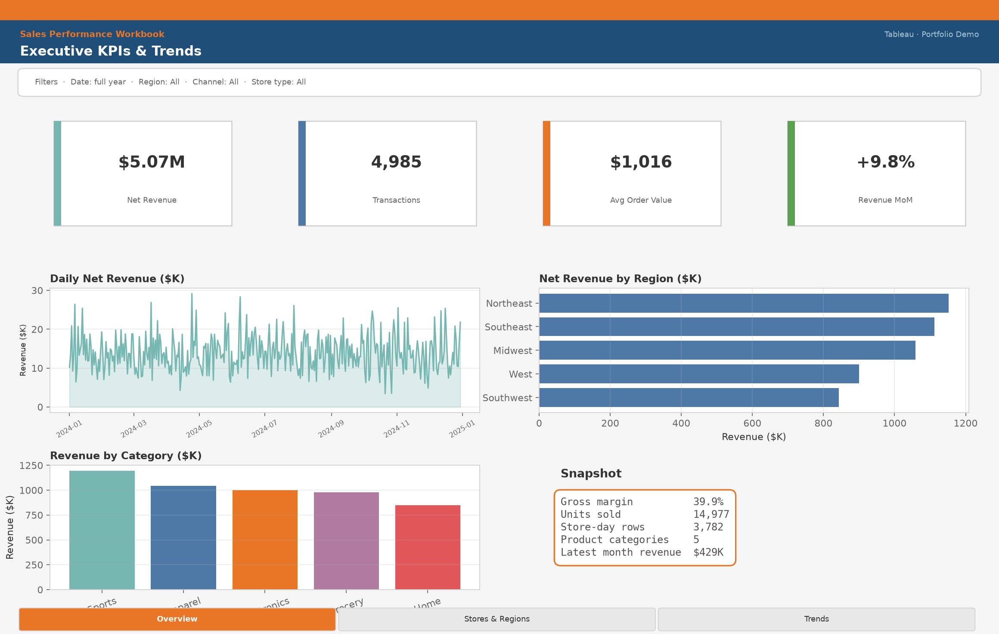
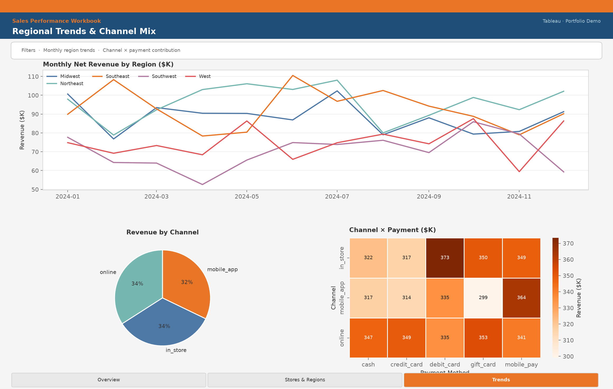
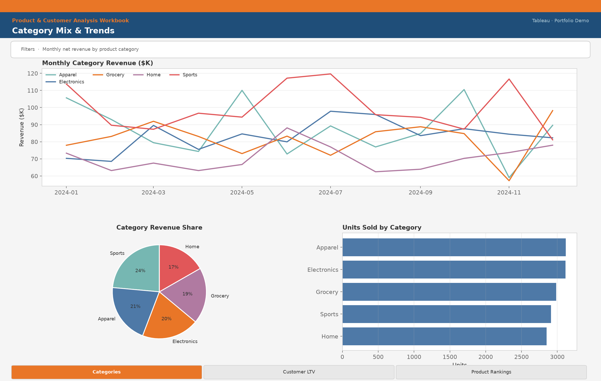
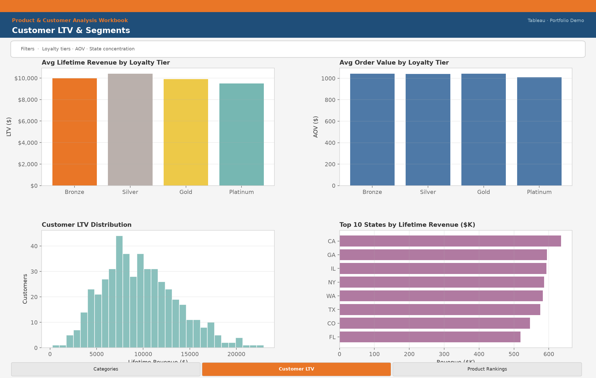
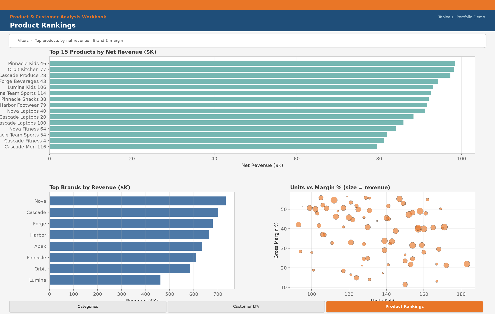
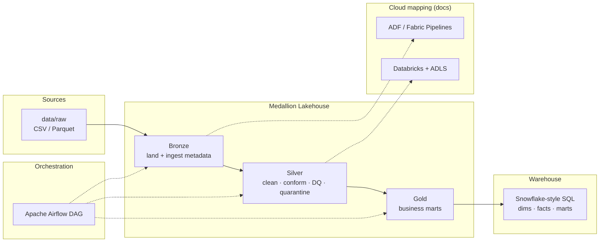

# Retail Sales Medallion Pipeline

Hire-ready **data engineering portfolio project**: end-to-end retail sales analytics using a bronze → silver → gold (medallion) architecture, with Airflow orchestration, Snowflake-flavored SQL marts, and cloud mapping docs for Azure Data Factory / Databricks / ADLS / Microsoft Fabric.

**Repo:** [github.com/user-JB007/retail-sales-pipeline](https://github.com/user-JB007/retail-sales-pipeline)

---

## Portfolio blurb

> Built a production-shaped retail sales pipeline that lands POS-style extracts into a medallion lakehouse layout, enforces data-quality gates (nulls, FKs, enums, positive amounts), quarantines bad rows, and publishes gold marts for store performance, category trends, customer LTV, and channel mix. Orchestration is expressed as an Airflow DAG; warehouse design is documented with Snowflake DDL; the same pattern maps to ADF + Databricks + Fabric for client delivery conversations. Runs locally with pandas in one command; PySpark job structure is ready when a cluster is available.

---

## Tableau Reports

**Primary BI tool: Tableau.** Full pipeline code **and** two Tableau workbooks live in this repo — view dashboards on GitHub without Tableau Desktop.

### Workbook A — Sales Performance
Executive KPIs, store/region performance, trends & channel mix.

| Page | Preview |
|------|---------|
| Overview |  |
| Stores & Regions |  |
| Trends |  |

### Workbook B — Product & Customer Analysis
Category mix, customer LTV/segments, product rankings.

| Page | Preview |
|------|---------|
| Categories |  |
| Customer LTV |  |
| Product Rankings |  |

**Desktop / Public rebuild** (workbook briefs, LOD calcs, sample mart CSVs): [`tableau/README.md`](tableau/README.md)

```bash
python scripts/run_local.py --engine pandas
python src/viz/generate_tableau_pages.py --export-samples
```


## Architecture



| Layer | What it does |
|-------|----------------|
| **Raw** | Synthetic stores, products, customers, transactions (demo-sized) |
| **Bronze** | Parquet landing with `_ingest_ts`, `_source_system`, run id |
| **Silver** | Typed dims/facts, quarantine invalid rows, DQ report |
| **Gold** | Daily store/category sales, CLV, product performance, channel mix |
| **SQL** | Snowflake-flavored schemas, dims, facts, gold CTAS/views |

---

## Tech stack

| Concern | Choice |
|---------|--------|
| Transforms | Python + **PySpark job structure** with **pandas fallback** (default for local/CI) |
| Architecture | Medallion (bronze / silver / gold) |
| Orchestration | Apache Airflow DAG (`dags/`) |
| Warehouse | Snowflake-flavored DDL + marts (`sql/`) |
| Quality | Custom DQ checks with fail-on-error gate |
| Cloud design | ADF, Databricks, ADLS, Fabric — see `docs/cloud_mapping.md` |

---

## Quick start

```bash
# 1. Clone & install
git clone https://github.com/user-JB007/retail-sales-pipeline.git
cd retail-sales-pipeline
python -m venv .venv && source .venv/bin/activate   # optional
pip install -r requirements.txt

# 2. Run the full demo (generate → bronze → silver → gold)
python scripts/run_local.py --engine pandas

# 3. Inspect outputs
ls data/gold/*/data.csv
cat data/gold/sample_outputs.json
```

Regenerate raw data only:

```bash
python -m src.generate_data --n-transactions 5000
```

Run layers individually:

```bash
python -m src.jobs.bronze_ingest --engine pandas
python -m src.jobs.silver_transform --engine pandas
python -m src.jobs.gold_aggregates --engine pandas
```

Tests:

```bash
pytest -q
```

### Optional PySpark

```bash
pip install "pyspark>=3.4,<4"   # requires Java 11+
unset FORCE_PANDAS
python scripts/run_local.py --engine spark
```

### Airflow

Point `RETAIL_PIPELINE_HOME` at this repo and drop `dags/retail_sales_pipeline_dag.py` into your Airflow `dags/` folder (or symlink). Task graph: `generate_or_refresh_raw → bronze_ingest → silver_transform_and_dq → gold_build_marts → warehouse_load_hint`.

---

## Project layout

```
retail-sales-pipeline/
├── README.md
├── requirements.txt / pyproject.toml
├── .env.example
├── config/pipeline.yaml
├── data/raw/                 # demo CSVs + parquet (committed)
├── src/
│   ├── generate_data.py
│   ├── jobs/                 # bronze → silver → gold
│   ├── quality/checks.py
│   ├── viz/generate_tableau_pages.py
│   └── utils/
├── dags/retail_sales_pipeline_dag.py
├── sql/                      # Snowflake-flavored DDL + marts
├── docs/architecture.md
├── docs/cloud_mapping.md
├── tableau/                  # workbook briefs, calcs, screenshots, sample marts
├── scripts/run_local.py
└── tests/
```

Derived `data/bronze|silver|gold` are produced locally and gitignored.

---

## Sample outputs

After `run_local.py`, gold marts include:

- `mart_daily_sales_by_store` — revenue, units, margin by store/day  
- `mart_daily_sales_by_category` — category trends  
- `mart_customer_lifetime_value` — order count, LTV, AOV by loyalty tier  
- `mart_product_performance` — top products by net revenue  
- `mart_channel_mix` — channel × payment method  

Silver also writes `quarantine_sales` for intentionally injected bad rows (orphan stores, negative qty, null amounts) so reviewers can see DQ behavior.

---

## Design notes for hiring managers / clients

- **Fail-closed DQ** in silver — pipeline raises if critical checks fail.  
- **Quarantine path** keeps bad rows auditable instead of silent drops.  
- **Engine switch** (`--engine pandas|spark|auto`) shows cluster-ready structure without blocking demos.  
- **SQL + cloud docs** bridge lakehouse code to warehouse and Azure/Fabric delivery.  
- **No secrets** — `.env.example` lists placeholders only.

More detail: [`docs/architecture.md`](docs/architecture.md) · [`docs/cloud_mapping.md`](docs/cloud_mapping.md)

---

## License

MIT — feel free to fork as a starting template for client POCs.
